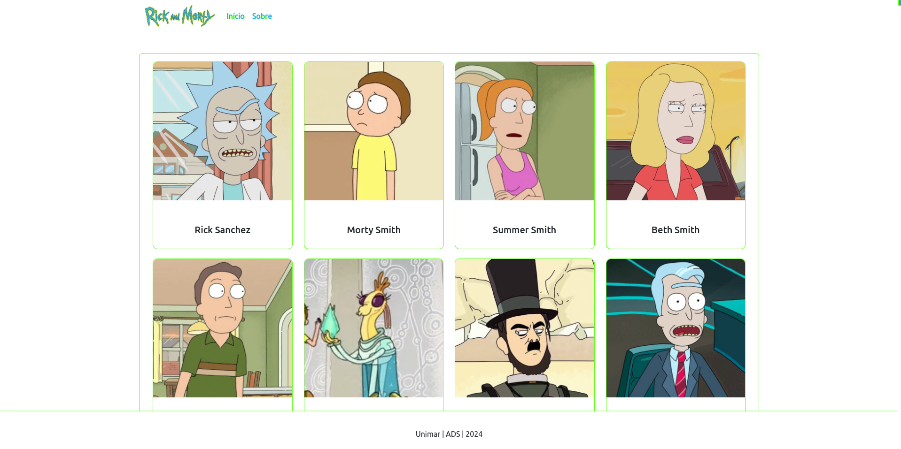
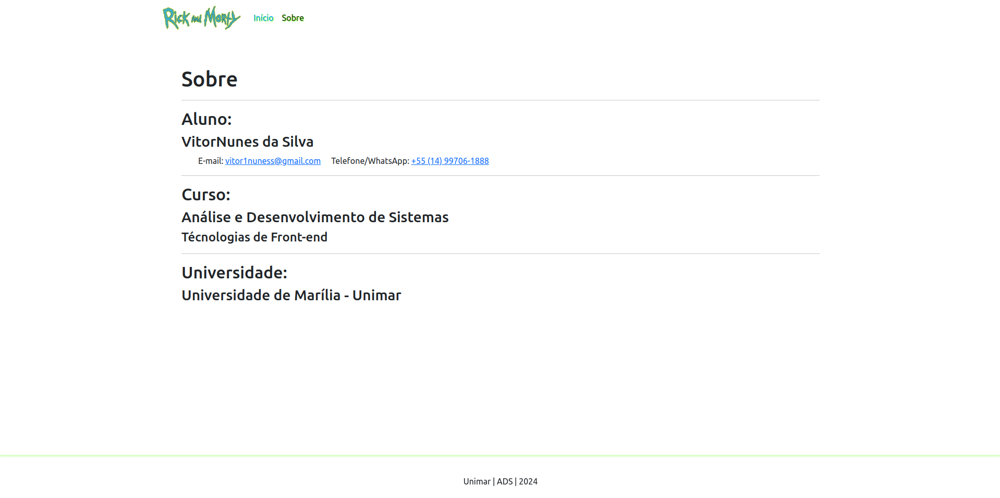
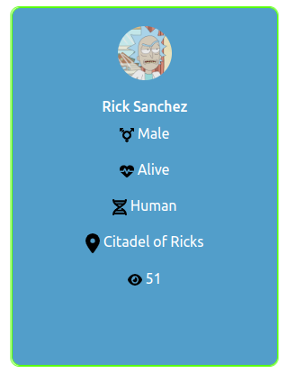

# Rick and Morty

Está aplicação acadêmica é uma listagem de todos os personagens da série "Rick and Morty". Também, com os personagens, temos breves detalhes sobre ele, como seu nome, status, espécie, gênero, localização atual e em quantos episódeos ele apareceu. Abaixo, algumas imagens das telas e dos cartões de cada personagem, também como utilizar.

## Telas

### Tela Início



### Tela Sobre



### Cartão do personagem - Frente


### Cartão do personagem - Atrás



## Utilização

### Clonar repositório

```sh
git clone https://github.com/VitorNuness/rick-e-morty-api-vue
```

### Instalar dependências

```sh
npm install
```

### Compilar para ambiente de desenvolvimento

```sh
npm run dev
```

### Compilar para produção

```sh
npm run build
```

## Autoria

Desenvolvido por **Vitor Nunes da Silva**.

#### Contato

**E-mail:** vitor1nuness@gmail.com

**Telefone/WhatsApp:** [+55 14 99706-1888](https://wa.me/5514997061888)
